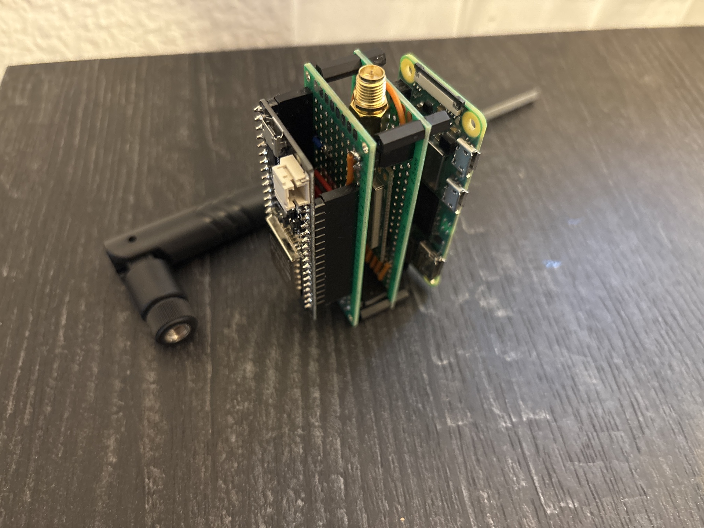
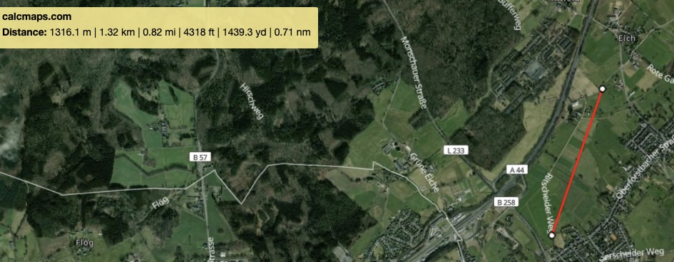
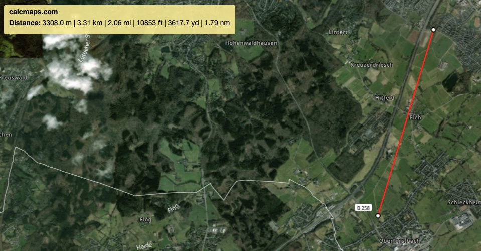
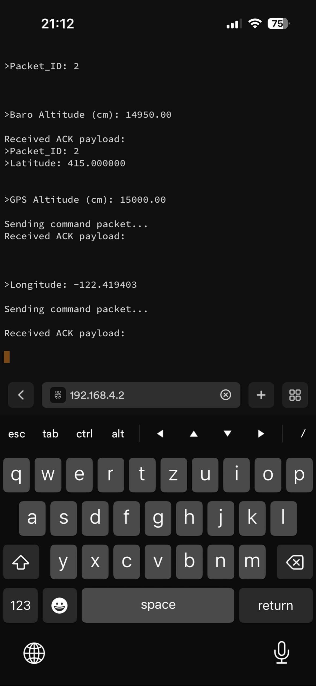

# Packet Radio Typed Bi Directional RF24 Communication

This is a project I have been trying to build for a while. 
The idea was to use nRF24 modules for bidirectional communication using acknowledgement payloads for a mini quadcopter, general sensor telemetry, or really anything that needs to send typed data wirelessly between two devices.

---

## The Problem I Was Solving

At first, I defined the data I wanted to send as C++ structs. That caused issues pretty quickly. 
I was using switch/if blocks to handle different struct types, which made sending and receiving complicated, and adding a new data type meant rewriting the core processing logic every time.

So I redid everything.

Since all packets shared a few things in common: serializing to a buffer, deserializing from a buffer, and printing their data I made a base `Packet` class that defines those three methods as pure virtuals. 
Every packet type (GPS, IMU, commands, etc.) inherits from it and overrides them. You can add your own as well.

This also solved the receiving side: when a packet comes in over the radio, you can assign it to a `Packet*` and call `serialOut()`, `fromBuffer()`, or pass it anywhere in your application.
Without caring what type it actually is until you need to.

---

## Architecture

The inspiration came from the OSI model after I was introduced to it. The idea of splitting responsibilities into layers made a lot of sense here:

| Layer | What it does |
|-------|-------------|
| **Layer 1** | The RF24 library, talks directly to the nRF24 hardware |
| **Layer 2** | `Connection` "configures" channel, address, data rate. Master and slave agree on this before anything is sent |
| **Layer 3** | `RFMaster` / `RFSlave` + `Packet` processes incoming and outgoing data, dispatches to the right type |
| **Layer 4** | Your application: flight controller, sensor node, whatever |

The `Connection` class is what ties master and slave together. In theory, by switching connection configurations at runtime, you could talk to multiple slaves, or even build something mesh like:
Each node has an ID, broadcasts itself, and other nodes forward the packet on. 
I haven't tested that yet, but the structure is there for it. 
The main thing missing for a proper mesh is loop prevention (sequence numbers, TTL, something like that).
And the header needs to be updated. 
That might be the next thing I work on open to suggestions. I would be happy for any contirbutions as well.

---

## What I Learned

- The OSI model and some basics of how layered communication works
- Memory management in C++: pointers, ownership, `new`/`delete`, heap corruption. ESP32 crashed a few times :)
- Base and derived classes in C++ (I knew this from Python and Java, but C++ makes you think about it more carefully, and i learned the base is called base, and the derived class is called derived class)
- Breaking a problem into smaller, independent pieces

---

## Hardware Used

- 2× nRF24L01 + PA + LNA Ebyte E01-ML01DP5
- 2× 100µF capacitors (one per module these matter!!)
- 2× Antennas salvaged from a D-Link DWA-137 N300 USB adapter (5 dBi)
- 2× ESP32 Lolin32 (one master, one slave any MCU works)
- Raspberry Pi Zero 2 connected to the Master for reading serial output.
In the image below you can see the esp32 on the left, in the middile the nRf24 by ebyte, and the pi zero 2. And in the background the antenna.

---

## Tests

### Test 1 Struct based version, ~1.3km

Running the original struct/switch version, I got a stable connection up to about 1.3km line of sight. I couldn't go further because the line of sight would have broken. The data transmitted fine, but the code was a mess.
Under .7src/README.md you can see a part of the older version.

This test was done a few months ago, im still searching for the output. Ill update this once found it.

---

### Test 2 Current version, ~3.3km

Running the examples in `./src/Examples`, I got a stable connection at 3.3km line of sight. I couldn't see the module anymore at that point but the values were still coming in clean. 
Sorry for the output, i had multiple SSH sessions with the pi from my phone, all of them were reading the serial input, which caused it to be a bit messy
Import note: The software did not increase the range, i just decided to give it a shot at 3km and it worked. 
During last test, i was not expecting anything over 1km. Especially because ebyte stated the range is ~2.5km.

**Settings:** 250 kbps, max PA level

---

## Usage

You can find examples under ./src/Examples

---

## Adding a New Packet Type

1. Add an entry to the `PacketID` enum in `Packet.hpp`
2. Inherit from `Packet`, implement `toBuffer()`, `fromBuffer()`, and `serialOut()`
3. Add a `case` to `Packet::create()` in `Packet.hpp`

That's it no changes needed to `RFMaster`, `RFSlave`, or `Connection`.

---

## Contributing

If you have ideas for the mesh implementation or anything else, feel free to open an issue or PR. I'm open to suggestions and critics.

## Features being worked on:
- Mesh Implementation
- Possible combine RFMaster and RFSlave, as they share some similarities such as init